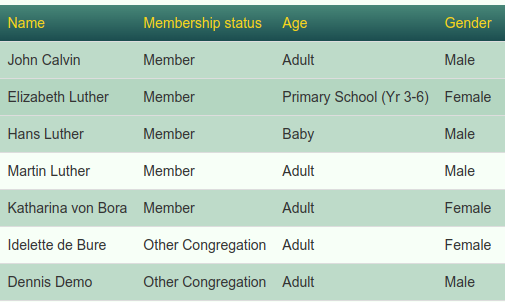
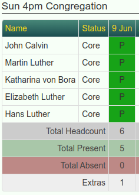

# Congregation Attendance Groups

## The problem

Jethro has an attendance marking problem. Everyone must be in just one congregation, and it is assumed that people will attend only that congregation. If you have, say, 10am and 4pm services, and a 10am person attends 4pm one day, you can't track that. The person would be marked absent by the 10am attendance marker and, not being listed for the 4pm, could count only towards to general headcount in 4pm.

This problem is tracked in a few issues, with workarounds discussed:

- https://github.com/tbar0970/jethro-pmm/issues/501
- https://github.com/tbar0970/jethro-pmm/issues/943

## Solution overview

The solution proposed here is to have an **automatically created and populated** Group per Congregation, and track attendance against the group, not the congregation. Each congregation (e.g. `Sun 10am`) has an group named after it (`Sun 10am Attendance`). We'll call these Congregation Attendance Groups.


Later when it comes to reporting, Congregation Attendance Group (henceforth 'Attendance Group' or CAG) membership records are automatically 'rolled up' into the congregation attendance. This allows you to see your congregation members' attendance, regardless of which service they attended.

## Auto-populating Congregation Attendance Groups

Since theoretically anyone known to Jethro might attend any service, each Attendance Group has to contain every Jethro person. This would be infeasible to maintain by hand, so Attendance Groups are automatically populated by a SQL script, invoked through the new 'custom reports' Jethro feature. Jethro 'custom reports' are custom SQL files that live on the server, invoked by clicking a link on the Reports page.


Normally a Custom Report's purpose is to generate a tabular read-only 'report', there's no reason the SQL can't make changes to Jethro's database too. In our case, clicking on our 'report' causes Attendance Group memberships to be wiped and re-populated.

While each Attendance Group has to contain every Jethro person, we set each person's group 'membership status' to reflect the likelihood of them attending. People in the 10am congregation get the highest 'Member' membership status in the '10am' Attendance Group, and thus appear at the top of the attendance marker's list. Next appear 10am'ers who are less regular ('crowd' person status mapping to Fringe' group membership status), and last of all, people in other congregations like 4pm ('Other Congregation' membership status).

| People | 10am Attendance Group | 4pm Attendance Group
|----|---|--|
| |  |  |


The rules for allocating Membership Status are embodied in the SQL 'report', which you will need to customise initially, as your Jethro will have different Person Status Options ('regular', 'irregular' etc) and Group Membership Status Options ('Leader', 'Member' etc), and you may have different ideas on how they should map. But once you have customized the SQL, with one click your Attendance Groups will be populated with every possible attendee, sorted by likelihood of attendance. The report should be clicked weekly, before marking attendance, so the Attendance Group contains any new persons added that week, and reflects status/congregation changes for existing persons.

Attendance Group memberships should never be modified by hand, as changes will be lost next time the report is clicked. Hopefully one day Jethro will support read-only groups to enforce this, but for now your Jethro members will just have to remember.

### Secondary Congregations

So far we have Attendance Groups auto-populated, containing everyone, sorted by likelihood of attendance, given their native congregation and person status (regular, irregular etc) . What happens to people like church staff, who routinely attend more than one service?

Since Jethro only allows one congregation per person, each staff member will have been allocated a 'primary' congregation, in whose Attendance Group they would appear as a 'Member', and in other Attendance Groups they will be 'Other Congregation' near the bottom. This is less than ideal.

To fix this we introduce a 'Secondary Congregations' custom field. 'Secondary Congregations' is a select list containing the names of all possible congregations (auto-generated, naturally). If a staff member's native congregation is 'Sun 10am', they can additionally be added to the 'Sun 4pm' Secondary Congregation. The SQL rules take this into account, and they become a 'Member' (or perhaps 'Leader') in the 4pm Attendance Group too.

So now, three variables determine Attendance Group status: person congregation, status and 'Secondary Congregations'. By editing these, and clicking the report afterwards, you can fine-tune your Attendance Group memberships. If your church prints labels, you can now create a Person Report listing Attendance Group members with statuses 'Member' and 'Leader', and get all likely attendees to print labels for.


## Attendance rollup

With Attendance Groups we can track attendance with precision, but often we just want to know "did so-and-so attend ANY service?".

Our solution is to treat the 'congregation' attendances, obsoleted by Attendance Groups, as a roll-up / summary of attendance for the day. If someone attended ANY group - say, 'Sun 10am', 'Sun 4pm' or nominated non-Attendance Group group like 'Youth Sunday School', then they are marked as having attended their congregation that day.

For example, given the following 10am and 4pm Attendance Group records:

| 10am                                                          | 4pm |
|---------------------------------------------------------------|-----|
|   |     |

The congregation attendances become:

| 10am                                                          | 4pm |
|---------------------------------------------------------------|-----|
|  |  |

Notice that Hans Luther was absent from his native 4pm service, but attended 10am that day as a guest, and so is marked Present in the 4pm congregation rollup.


This aggregation of Attendance Group attendances into Congregation attendances is achieved with another SQL 'report', to be clicked after recording group attendances. 


As congregation attendances are auto-generated, Jethro users must remember to never mark attendance directly against the congregation. Hopefully one day we'll be able to mark congregations read-only to enforce this.

# Solution Summary

Congregation Attendance Groups should be a net win for everyone:
 - attendance markers' job is easier: there's no worrying that someone isn't on the list because their attend a different congregation. Everyone is there somewhere.
- church leadership get better attendance tracking

The cost is that markers need to be somewhat aware of what's going on:
 - Mark attendance on the Attendance Groups, not the congregations.
 - No marking attendance in congregations
 - No editing membership of Attendance Groups
 - Before marking attendance, click the `Step 4 - Regenerate Attendance Group Members`.
 - After marking attendance, click the `Step 6 - Regenerate Congregational Attendances From Congregation Attendance Groups` to rollup attendances from groups to congregation.


# Installation

No code changes are made - just various (database-altering) 'reports' added.

## Enable Jethro Custom Reports

You will need Jethro 2.35.0 or above. Edit your `conf.php` and uncomment and customize `CUSTOM_REPORTS_DIR`:

```
// The place where custom report SQL files are stored
// Defaults to [yourJethroRoot]/custom_reports
define('CUSTOM_REPORTS_DIR', '/home/jethro/custom_reports');
```

Create the `custom_reports` directory, and ensure it is readable by the PHP runtime user (e.g. `chgrp www-data custom_reports; chmod ug+rx custom_reports`).

Create a `test.sql` file within `custom_reports/` to test:
```sql
select count(*) from _person;
```
In Jethro, go to Persons -> Reports and ensure you see a new 'test' report at the bottom.

## Copy the Attendance Group reports

Copy the SQL files from this project into your `custom_reports/`, and again ensure they are readable by PHP. Do not click any yet!

## Run the reports

Setup involves clicking through a series of 'reports' to change your Jethro database.


### Step 0

Make a MySQL database backup before proceeding!

### Step 1
If your church currently records attendance via congregation, not groups, then click the 'Step 1 - Create Congregation Attendance Groups' report. This will create a Attendance Group per attendable congregation.

The idea of 'congregation groups' is not new, and many churches will already have groups defined, manually populated with members, and with attendances marked against them. These churches should rename their groups to `<Congregation shortname> Attendance`. E.g. if there is a Congregation with short name 'Sun 10am', the attendance group must be named 'Sun 10am Attendance' (case-sensitive).

### Step 2
Either way, now click `Step 2 - Show Congregation Attendance Groups` to verify that your Congregation Attendance Groups (renamed or newly created) are all showing.

### Step 3

Next, click `Step 3 - one-off - create and populate Secondary Congregations customfield`. Now:
 - Under Admin -> Custom Fields, you will see a new 'Secondary Congregations' field.
 - Under Person -> Reports, you will see a new 'People in Secondary Congregations' report. If you had pre-existing congregation groups, you will see that 'Secondary Congregations' has been set for people whom it was implied. E.g. if Simon is in congregation 'Sun 10am' but was in a congregation group 'Sun 4pm', then he gets a 'Sun 4pm' Secondary Congregation.

### Step 4

Now we come to `Step 4 - Regenerate Attendance Group Members`, which contains the rules on how to set Attendance Group membership statuses for each person, given their congregation, status and Secondary Congregations. This is the one SQL file that you probably should edit before proceeding. It's quite safe to run the unedited version - you just won't get the desired mapping until you do some customizing.

By default, the SQL:
 - creates two new Group Membership Status Options: `Other Congregation` and `Fringe`. 
 - populates the Attendance Groups, using 
```sql
       (CASE
            WHEN _person.congregationid = cg.congregationid
                 OR secondarycongregation.id = cg.congregationid THEN CASE _person.status
                                                 WHEN 0 THEN 1 -- Core -> Member

                                                 WHEN 1 THEN 1 -- Flock -> Member

                                                 WHEN 2 THEN 1 -- Connecting -> Member

                                                 WHEN 3 THEN 2 -- Staff -> Leader

                                                 WHEN 4 THEN 7 -- Fringe -> Fringe

                                                 WHEN 5 THEN 7 -- Satellite Members -> Fringe   (e.g. Tina Edwards - no attendance)

                                                 WHEN 6 THEN 1 -- Youth Contact -> Member

                                                 ELSE @pgms_fringe -- * -> Fringe

                                             END
            ELSE @pgms_othercongregation -- Other Congregation
```

In English: if a person's native congregation or 'Secondary Congregation' matches the Attendance Group, then set their membership status according to their status (defaulting to `Fringe`). Otherwise if they're not in the Attendance Group, set their status to `Other Congregation`.

Your Person Status Options (the `WHEN x` part) and Group Membership Status Options (the `THEN y` part) are almost certainly not what the comments above imply, so you will need to customize this part.

After customizing `Step_4_-_Regenerate_Attendance_Group_members.sql`, run it by clicking the `Step 4 - Regenerate Attendance Group Memberss` report in Jethro. It is safe to do this as many times as you need to, to get the mappings correct. The SQL wipes and regenerates the memberships from scratch each time.

After running this, go to Groups -> List All, find your Attendance Groups, and you should find them all populated with members, with membership status set appropriately per group.


### Step 5

Now run `Step 5 - one-off - Backport congregation attendances to groups`. If your church had previously marked attendance against congregations, those attendances will be copied over to the new Attendance Groups. This is safe to run if your Attendance Groups contain attendance records already.

Now, under Attendance -> Display, pick your new Attendance Group in the drop-down, and you should see attendances marked against it.

### Step 6

Finally, run `Step 6 - Regenerate congregational attendances from Congregation Attendance Groups`. Here the congregation attendances are wiped and regenerated from Attendance Group attendances. Hopefully no data is lost if Step 5 did its job! If you have non-Attendance Group groups whose attendances you wish rolled in, edit `Step_6_-_Regenerate_congregational_attendances_from_Congregation_Attendance_Groups.sql` first.

After Step 6, go to Attendance -> Display, pick a congregation (not a group), and verify that it has attendances.

### Step 7

If everything worked, henceforth you'll only need `Step 4 - Regenerate Attendance Group Members` and `Step 6 - Regenerate Congregational Attendances From Congregation Attendance Groups` and can delete the rest to avoid confusion.

# Future Work

This is almost as far as we can go without Jethro code modifications. I tried a database trigger to regenerate group memberships when person status/congregation changed, but it failed (`General error: 1442 Can't update table 'person_group_membership' in stored function/trigger because it is already used by statement which invoked this stored function/trigger`).

The two steps (automating group membership repopulation and automatically rolling up congregation attendances) could be triggered by an external shell script. A script that does this can be found in `attendancegroup_refresher/`.

